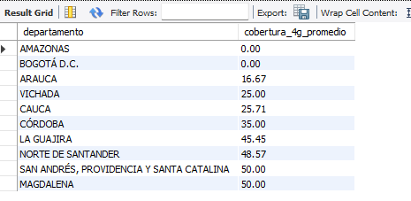
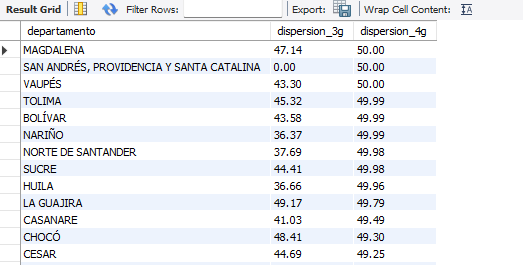
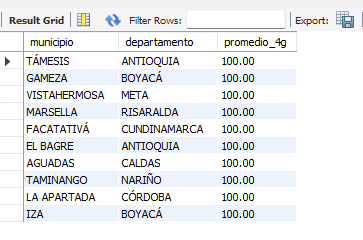
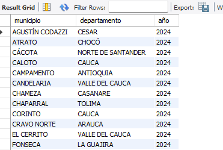

**Análisis de Cobertura Tecnológica y Brecha Digital en Colombia --
Proyecto Final Bootcamp\**

**1. Introducción\**
Este documento reúne y documenta un conjunto de consultas SQL avanzadas
para el análisis de la cobertura tecnológica y la brecha digital en
Colombia. Está diseñado como entregable final de Bootcamp, con un
formato técnico que incluye objetivos, lógica de cada consulta, y
ejemplos de interpretación.

**2. Objetivo del análisis\**
Calcular indicadores de cobertura (2G, 3G, 4G, LTE, 5G) a nivel
nacional, departamental y municipal; identificar brechas y desigualdades
regionales; medir evolución temporal y comparar desempeño entre
proveedores.

**3. Fuentes y variables\**

Tablas principales utilizadas:

- cobertura_movil: Registros de cobertura por municipio, año y
  tecnología (valores \'SI\'/\'NO\' y/o columnas numéricas).

- municipios: Catálogo de municipios con cod_municipio y
  cod_departamento.

- departamentos: Catálogo de departamentos con cod_departamento y
  nombre.

Variables clave usadas en las consultas:

1.  cobertura_2g, cobertura_3g, cobertura_4g, cobertura_lte,
    cobertura_5g (valores \'SI\'/\'NO\').

2.  anio, cod_municipio, cod_departamento, id_proveedor.

**A. Resumen nacional por tecnología (último año)\**

Propósito: Calcular el promedio nacional de cobertura por tecnología en
el año más reciente. Interpretación: Cada columna devuelve el porcentaje
promedio (0-100) de observaciones con valor \'SI\' para la tecnología
indicada. Útil para evaluar penetración tecnológica nacional.

**SQL:\**

SELECT\
(SELECT MAX(anio) FROM cobertura_movil) AS anio,\
ROUND(AVG(CASE WHEN cobertura_2g = \'SI\' THEN 100 ELSE 0 END), 2) AS
promedio_2g,\
ROUND(AVG(CASE WHEN cobertura_3g = \'SI\' THEN 100 ELSE 0 END), 2) AS
promedio_3g,\
ROUND(AVG(CASE WHEN cobertura_4g = \'SI\' THEN 100 ELSE 0 END), 2) AS
promedio_4g,\
ROUND(AVG(CASE WHEN cobertura_lte = \'SI\' THEN 100 ELSE 0 END), 2) AS
promedio_lte,\
ROUND(AVG(CASE WHEN cobertura_5g = \'SI\' THEN 100 ELSE 0 END), 2) AS
promedio_5g\
FROM cobertura_movil\
WHERE anio = (SELECT MAX(anio) FROM cobertura_movil);

{width="5.614583333333333in"
height="1.1458333333333333in"}

**B. Top 10 departamentos por índice de conectividad\**

Propósito: Identificar los 10 departamentos con mejor índice de
conectividad total, calculado como el promedio simple de disponibilidad
de 2G, 3G, 4G, LTE y 5G. Interpretación: índice_conectividad es un
promedio porcentual (0-100).

**SQL:\**

SELECT\
d.nombre AS departamento,\
ROUND(AVG(\
(CASE WHEN c.cobertura_2g = \'SI\' THEN 100 ELSE 0 END +\
CASE WHEN c.cobertura_3g = \'SI\' THEN 100 ELSE 0 END +\
CASE WHEN c.cobertura_4g = \'SI\' THEN 100 ELSE 0 END +\
CASE WHEN c.cobertura_lte = \'SI\' THEN 100 ELSE 0 END +\
CASE WHEN c.cobertura_5g = \'SI\' THEN 100 ELSE 0 END) / 5\
), 2) AS indice_conectividad\
FROM cobertura_movil c\
JOIN municipios m ON c.cod_municipio = m.cod_municipio\
JOIN departamentos d ON c.cod_departamento = d.cod_departamento\
WHERE c.anio = (SELECT MAX(anio) FROM cobertura_movil)\
GROUP BY d.nombre\
ORDER BY indice_conectividad DESC\
LIMIT 10;

{width="3.6354166666666665in"
height="2.3541666666666665in"}

**C. Departamentos con menor cobertura 4G\**

Propósito: Listar los 10 departamentos con menor promedio de cobertura
4G. Interpretación: permite identificar regiones más rezagadas en acceso
a 4G.

**SQL:\**

SELECT\
d.nombre AS departamento,\
ROUND(AVG(CASE WHEN c.cobertura_4g = \'SI\' THEN 100 ELSE 0 END), 2) AS
cobertura_4g_promedio\
FROM cobertura_movil c\
JOIN departamentos d ON c.cod_departamento = d.cod_departamento\
WHERE c.anio = (SELECT MAX(anio) FROM cobertura_movil)\
GROUP BY d.nombre\
ORDER BY cobertura_4g_promedio ASC\
LIMIT 10;

{width="4.84375in" height="2.3645833333333335in"}

**D. Desigualdad interna por departamento (STDDEV)\**

Propósito: Calcular la dispersión interna (desviación estándar) de
cobertura 3G y 4G entre municipios de cada departamento. Interpretación:
valores altos de dispersion_4g o dispersion_3g indican heterogeneidad
--- grandes brechas internas.

**SQL:\**

SELECT\
d.nombre AS departamento,\
ROUND(STDDEV(CASE WHEN c.cobertura_3g = \'SI\' THEN 100 ELSE 0 END), 2)
AS dispersion_3g,\
ROUND(STDDEV(CASE WHEN c.cobertura_4g = \'SI\' THEN 100 ELSE 0 END), 2)
AS dispersion_4g\
FROM cobertura_movil c\
JOIN departamentos d ON c.cod_departamento = d.cod_departamento\
WHERE c.anio = (SELECT MAX(anio) FROM cobertura_movil)\
GROUP BY d.nombre\
ORDER BY dispersion_4g DESC;

{width="5.447916666666667in"
height="2.7604166666666665in"}

**E. Evolución temporal nacional por tecnología (2G-4G)\**

Propósito: Mostrar la evolución temporal (serie histórica) de la
adopción tecnológica (2G, 3G, 4G) a nivel nacional. Interpretación:
permite detectar tendencias de crecimiento o declive por tecnología a lo
largo de los años.

**SQL:\**

SELECT\
anio,\
ROUND(AVG(CASE WHEN cobertura_2g = \'SI\' THEN 100 ELSE 0 END), 2) AS
promedio_2g,\
ROUND(AVG(CASE WHEN cobertura_3g = \'SI\' THEN 100 ELSE 0 END), 2) AS
promedio_3g,\
ROUND(AVG(CASE WHEN cobertura_4g = \'SI\' THEN 100 ELSE 0 END), 2) AS
promedio_4g\
FROM cobertura_movil\
GROUP BY anio\
ORDER BY anio;

{width="3.8229166666666665in"
height="2.0520833333333335in"}

**F. Top 10 municipios por cobertura 4G\**

Propósito: Listar los 10 municipios con mejor cobertura promedio 4G en
el año más reciente. Interpretación: Útil para identificar núcleos
urbanos o municipios con alta conectividad móvil.

**SQL:\**

SELECT\
m.nombre AS municipio,\
d.nombre AS departamento,\
ROUND(AVG(CASE WHEN c.cobertura_4g = \'SI\' THEN 100 ELSE 0 END), 2) AS
promedio_4g\
FROM cobertura_movil c\
JOIN municipios m ON c.cod_municipio = m.cod_municipio\
JOIN departamentos d ON c.cod_departamento = d.cod_departamento\
WHERE c.anio = (SELECT MAX(anio) FROM cobertura_movil)\
GROUP BY m.nombre, d.nombre\
ORDER BY promedio_4g DESC\
LIMIT 10;

{width="3.78125in" height="2.5in"}

**G. Municipios con menor conectividad general\**
Propósito: Identificar municipios con muy baja conectividad (3G \< 30% y
4G \< 10%). Interpretación: zonas críticas que pueden requerir
intervención prioritaria.\
**SQL:\**
SELECT\
m.nombre AS municipio,\
d.nombre AS departamento,\
ROUND(AVG(CASE WHEN c.cobertura_3g = \'SI\' THEN 100 ELSE 0 END), 2) AS
promedio_3g,\
ROUND(AVG(CASE WHEN c.cobertura_4g = \'SI\' THEN 100 ELSE 0 END), 2) AS
promedio_4g\
FROM cobertura_movil c\
JOIN municipios m ON c.cod_municipio = m.cod_municipio\
JOIN departamentos d ON c.cod_departamento = d.cod_departamento\
WHERE c.anio = (SELECT MAX(anio) FROM cobertura_movil)\
GROUP BY m.nombre, d.nombre\
HAVING promedio_3g \< 30 AND promedio_4g \< 10\
ORDER BY promedio_4g ASC\
LIMIT 10;

{width="4.4375in" height="2.3645833333333335in"}

**H. Municipios completamente desconectados\**

Propósito: Enumerar municipios completamente desconectados (sin 2G, 3G,
4G ni 5G) en el año más reciente. Interpretación: lista de municipios
que requieren cobertura mínima urgente.

**SQL:\**

SELECT\
m.nombre AS municipio,\
d.nombre AS departamento,\
c.anio AS año\
FROM cobertura_movil c\
JOIN municipios m ON c.cod_municipio = m.cod_municipio\
JOIN departamentos d ON c.cod_departamento = d.cod_departamento\
WHERE c.anio = (SELECT MAX(anio) FROM cobertura_movil)\
AND c.cobertura_2g = \'NO\'\
AND c.cobertura_3g = \'NO\'\
AND c.cobertura_4g = \'NO\'\
AND c.cobertura_5g = \'NO\'\
GROUP BY m.nombre, d.nombre, c.anio;

{width="3.8645833333333335in" height="2.59375in"}

**I. Ranking de proveedores por cobertura 4G\**

Propósito: Rankear proveedores según su cobertura promedio 4G.
Interpretación: identifica operadores con mejor desempeño en 4G.

**SQL:\**

SELECT\
p.nombre AS proveedor,\
P.nombre_comercial AS comercial,\
ROUND(AVG(CASE WHEN c.cobertura_4g = \'SI\' THEN 100 ELSE 0 END), 2) AS
cobertura_4g_promedio\
FROM cobertura_movil c\
JOIN proveedores p ON c.id_proveedor = p.id_proveedor\
WHERE c.anio = (SELECT MAX(anio) FROM cobertura_movil)\
GROUP BY p.nombre\
ORDER BY cobertura_4g_promedio DESC\
LIMIT 5;

{width="5.6674573490813644in"
height="1.6460629921259842in"}

**J. Evolución departamental de cobertura 4G\**

Propósito: Mostrar la evolución departamental de la cobertura 4G por
año. Interpretación: permite comparar progreso temporal en cada
departamento.

**SQL:\**

SELECT\
d.nombre AS departamento,\
c.anio,\
ROUND(AVG(CASE WHEN c.COBERTURA_4G = \'SI\' THEN 100 ELSE 0 END), 2) AS
cobertura_promedio_4g\
FROM cobertura_movil c\
JOIN municipios m ON c.cod_municipio = m.cod_municipio\
JOIN departamentos d ON m.cod_departamento = d.cod_departamento\
GROUP BY d.nombre, c.anio\
ORDER BY d.nombre, c.anio\
LIMIT 1000;

{width="3.7505238407699037in"
height="2.792055993000875in"}

**K. Comparación de cobertura por departamento\**

Propósito: Comparación general de cobertura por departamento (2G, 3G,
4G, LTE). Interpretación: tabla agregada que facilita identificar
departamentos líderes y rezagados.

**SQL:\**

SELECT\
d.nombre,\
ROUND(AVG(CASE WHEN cobertura_2g = \'SI\' THEN 1 ELSE 0 END)\*100,2) AS
pct_2g,\
ROUND(AVG(CASE WHEN cobertura_3g = \'SI\' THEN 1 ELSE 0 END)\*100,2) AS
pct_3g,\
ROUND(AVG(CASE WHEN cobertura_4g = \'SI\' THEN 1 ELSE 0 END)\*100,2) AS
pct_4g,\
ROUND(AVG(CASE WHEN cobertura_lte = \'SI\' THEN 1 ELSE 0 END)\*100,2) AS
pct_lte\
FROM cobertura_movil c\
JOIN departamentos d ON c.cod_departamento = d.cod_departamento\
GROUP BY d.nombre\
ORDER BY pct_4g DESC;

{width="3.854704724409449in"
height="2.812892607174103in"}

**L. Comparativa departamental vs promedio nacional (4G)\**

Propósito: Comparar el promedio departamental de 4G vs el promedio
nacional y mostrar diferencia. Interpretación: diferencia_vs_promedio \>
0 indica que el departamento está por encima del promedio nacional.

**SQL:\**

SELECT\
d.nombre,\
ROUND(AVG(CASE WHEN cobertura_4g = \'SI\' THEN 1 ELSE 0 END)\*100,2) AS
pct_4g_departamento,\
(SELECT ROUND(AVG(CASE WHEN cobertura_4g = \'SI\' THEN 1 ELSE 0
END)\*100,2)\
FROM cobertura_movil) AS pct_4g_nacional,\
ROUND(AVG(CASE WHEN cobertura_4g = \'SI\' THEN 1 ELSE 0 END)\*100,2) -\
(SELECT ROUND(AVG(CASE WHEN cobertura_4g = \'SI\' THEN 1 ELSE 0
END)\*100,2)\
FROM cobertura_movil) AS diferencia_vs_promedio\
FROM cobertura_movil c\
JOIN departamentos d ON c.cod_departamento = d.cod_departamento\
GROUP BY d.nombre\
ORDER BY diferencia_vs_promedio DESC;

{width="5.031952099737532in"
height="2.7503838582677167in"}
